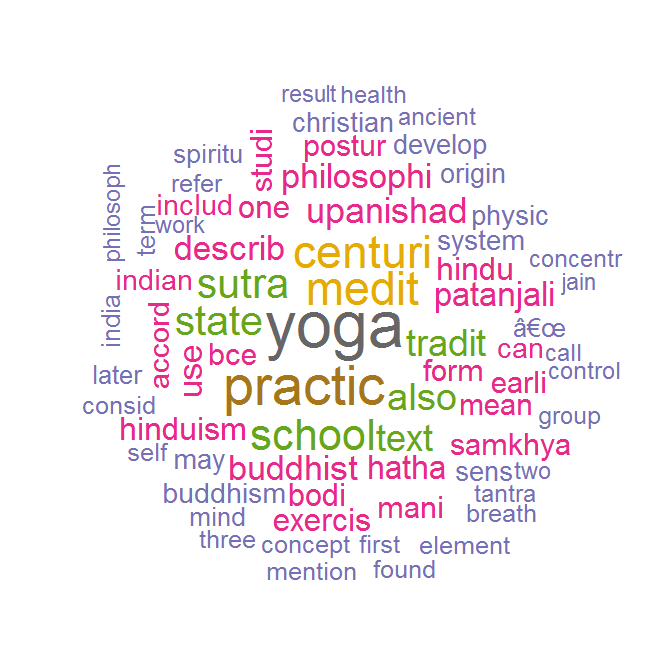
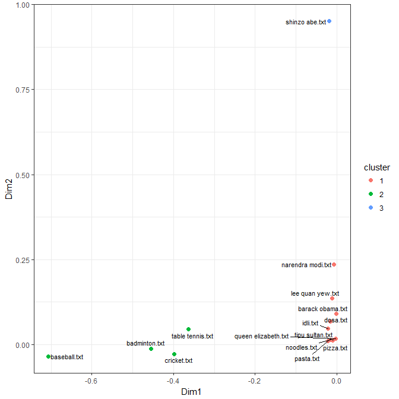
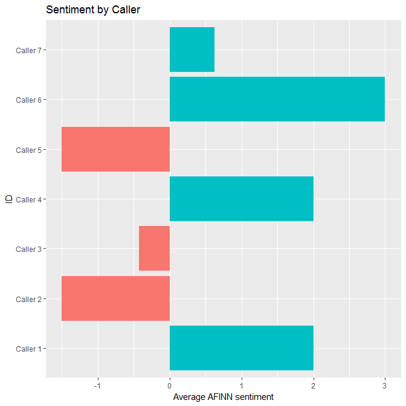

# Text analysis
Jose Parreno Garcia  
February 2018  
<style>
body {
text-align: justify}

</style>

<br>


```r
library(knitr)
```

In this blog we will explore various concepts in text mining:

* Scraping webpages and processing texts
* Corpus, TDM, TF-IDF, Word cloud
* Cosine similarity and Latent Semantic Analysis
* Extracting topics and Latent Dirichlet Allocation
* Sentiment scoring and tidytext and syuzhet
* Classifying texts with RTextTools

<br>

# Scraping webpages and processing texts

## Reading text files

Text files are typically read using the **readLines()** function.


```r
# Each text is saved in a character vector
text = readLines("https://raw.githubusercontent.com/selva86/datasets/master/yoga.txt")
```

```
## Warning in readLines("https://raw.githubusercontent.com/selva86/datasets/master/yoga.txt"): incomplete final line found on 'https://raw.githubusercontent.com/selva86/datasets/master/yoga.txt'
```

```r
text[1:5]
```

```
## [1] "The ancient yogic discipline is far more than a fitness method for physical health or a psychological tool to achieve peace and happiness. "                                              
## [2] "    Wellness of body and mind, often touted as the primary benefit of modern yoga practice, is merely a by-product of becoming a fully balanced and vibrantly alive being. "              
## [3] "    The Sanskrit word 'yoga' comes from the word 'yuj' which means, 'to unite'."                                                                                                          
## [4] "    Hence, yoga is the union of the individual with the whole of existence, also commonly referred to as 'self-realization', 'nirvana', 'mukti',  or 'enlightenment'."                    
## [5] "    Yoga also refers to the inner technology that will lead one to this experience â<U+0080><U+0093> a technology formulated from rigorous inner observation, by ancient yogis over thousands of years."
```

## Rvest package for HTML code in a webpage

All webpages have a source HTML code behind it that you can view by right-clicking and viewing HTML source code. HTML is a semi-structured way of organising scripts, where you have tags that represent objects. Those tags can have also inner tags. So for example, in the image below you see there is a <head> and a <body> tag. Think of these as sections. Within <head> you would write all meta-data or meta-information, and with <body> you would write the bit of script that generates the webpage content.


It could be possible to read the HTML code that forms a webpage using the **readLines()** but it could be massively messy. Check it out just below:


```r
# Each text is saved in a character vector
text = readLines("https://en.wikipedia.org/wiki/Yoga")
head(text)
```

```
## [1] "<!DOCTYPE html>"                                                                                                                                    
## [2] "<html class=\"client-nojs\" lang=\"en\" dir=\"ltr\">"                                                                                               
## [3] "<head>"                                                                                                                                             
## [4] "<meta charset=\"UTF-8\"/>"                                                                                                                          
## [5] "<title>Yoga - Wikipedia</title>"                                                                                                                    
## [6] "<script>document.documentElement.className = document.documentElement.className.replace( /(^|\\s)client-nojs(\\s|$)/, \"$1client-js$2\" );</script>"
```

The best way to approach this is using the **Rvest** package. To **Rvest** you can specify what element from the webpage you want to extract. To dont necessarily want all of the HTML code, just the one that represents a table, or a paragraph or something in the webpage. An easy way to look for the code that represents an object in the webpage is by opening the HTML source code, hovering over different elements until you find the one you are looking for and then copying the HTML code.


So

* On one side we have the page, where all the html code is saved as an XML object class
* Then we copied the select code to the selector variable. This represents a paragrah in the webpage
* We then extract the bit represented by the selector within the whole XML object class


```r
library(dplyr)
library(rvest)

# Import page
page = read_html("https://es.wikipedia.org/wiki/RStudio")
page
```

```
## {xml_document}
## <html class="client-nojs" lang="es" dir="ltr">
## [1] <head>\n<meta http-equiv="Content-Type" content="text/html; charset=UTF-8">\n<meta charset="UTF-8">\n<title>RStudio - Wikipedia, la enciclopedia libre</title>\n<script>document.documentElement.className = document.documentElement.className.rep ...
## [2] <body class="mediawiki ltr sitedir-ltr mw-hide-empty-elt ns-0 ns-subject page-RStudio rootpage-RStudio skin-vector action-view">\t\t<div id="mw-page-base" class="noprint"></div>\n\t\t<div id="mw-head-base" class="noprint"></div>\n\t\t<div id=" ...
```

```r
# Import select
selector = "#mw-content-text > div > p:nth-child(2)"

# Using CSS selector
txt = page %>% html_node(css = selector) %>% html_text()
txt
```

```
## [1] "RStudio es un entorno de desarrollo integrado (IDE) para el lenguaje de programación R, dedicado a la computación estadística y gráficos. Incluye una consola, editor de sintaxis que apoya la ejecución de código, así como herramientas para el trazado, la depuración y la gestión del espacio de trabajo."
```

## Example: selecting all text from page - not selecting contents, images, etc


```r
library(dplyr)

# Import page
page = read_html("https://es.wikipedia.org/wiki/Valencia")

# Extract info that are within the paragraph tags in the HTML code (denotes by "p")
# The only problem you can see if that there are some minor extra HTML codes and notations and things that we might want to get rid off if we only want the text
txt = page %>% html_nodes("p") %>% html_text()
head(txt, 1)
```

```
## [1] "Valencia (en valenciano y oficialmente València,[5]<U+200B> AFI: [va'lensia])[6]<U+200B>es un municipio[7]<U+200B>y una ciudad de España, capital de la provincia homónima y de la Comunidad Valenciana. Anteriormente, Valencia fue también capital de la extinta comarca de la Huerta de Valencia, comarca que en 1989[8]<U+200B> se disgregó para formar las comarcas de la Huerta Norte, Huerta Sur, Huerta Oeste y ciudad de Valencia, quedando así constituida como la única ciudad-comarca de la Comunidad Valenciana."
```

```r
# Cleaning text with regexp 
# remove HTML code
pattern = "</?\\w+((\\s+\\w+(\\s*=\\s*(?:\".*?\"|'.*?'|[^'\">\\s]+))?)+\\s*|\\s*)"
txt1 = stringr::str_replace_all(txt, pattern,"")

#  remove extra space between words
txt1 = stringr::str_wrap(txt1)

# remove citations
txt1 = stringr::str_replace_all(txt1, "\\[.*\\]", "")

head(txt1, 1)
```

```
## [1] "Valencia (en valenciano y oficialmente València,<U+200B>es un\nmunicipio<U+200B>y una ciudad de España, capital de la provincia homónima y de la\nComunidad Valenciana. Anteriormente, Valencia fue también capital de la extinta\ncomarca de la Huerta de Valencia, comarca que en 1989<U+200B> se disgregó para\nformar las comarcas de la Huerta Norte, Huerta Sur, Huerta Oeste y ciudad de\nValencia, quedando así constituida como la única ciudad-comarca de la Comunidad\nValenciana."
```

<br>

# Corpus, TDM, TF-IDF, Word cloud

## Corpus

A corpus is a collection of text documents. In comparison with the above where we worked with strings or character vectors, a corpus can be though of a library. Say you had 300 books, then a corpus will have an object for all of those 300 books. Then, we would be able to break down those individual elements in the corpus to sentences/words/etc.

The example below:

* We read a text file that breaks the text into lines and saves it as a character vector
* Then we create a corpus using the vector (we could also load a directory full of files with **Corpus(DirSource())**).
* This corpus contains 372 "documents" -> in this case, 372 lines. Each sentence in this case is treated as a document.
* If you want more details about each document (in this case sentence), you  can always use the **inspect()** function.
* As you can see using **inspect()**, there is an element of metadata for each document. If you wish, you can edit this too.


```r
library(tm)

# Read text
char_vec = readLines("https://raw.githubusercontent.com/selva86/datasets/master/yoga_wiki.txt")

# Create Corpus
cp = Corpus(VectorSource(char_vec))
cp
```

```
## <<SimpleCorpus>>
## Metadata:  corpus specific: 1, document level (indexed): 0
## Content:  documents: 372
```

```r
# Different ways of inspecting the document
inspect(cp[[6]])
```

```
## <<PlainTextDocument>>
## Metadata:  7
## Content:  chars: 139
## 
## The Yoga Sutras of Patanjali date from the first half of the 1st millennium CE, but only gained prominence in the West in the 20th century.
```

```r
cp[[15]]$content
```

```
## [1] "By figurative extension from the yoking or harnessing of oxen or horses, the word took on broader meanings such as employment, use, application, performance (compare the figurative uses of to harness as in to put something to some use)."
```

```r
as.character(cp[[15]])
```

```
## [1] "By figurative extension from the yoking or harnessing of oxen or horses, the word took on broader meanings such as employment, use, application, performance (compare the figurative uses of to harness as in to put something to some use)."
```

### Cleaning the corpus

* The **tm()** package offer a number of transformations that we could directly apply to the text. Examples in the code.
* Given that these transformations are nothing more than functions, we could also build our own transformers!


```r
library(SnowballC)

# Transformations in tm package
getTransformations()
```

```
## [1] "removeNumbers"     "removePunctuation" "removeWords"       "stemDocument"      "stripWhitespace"
```

```r
# Removing html transformer
pattern = "</?\\w+((\\s+\\w+(\\s*=\\s*(?:\".*?\"|'.*?'|[^'\">\\s]+))?)+\\s*|\\s*)"
rmHTML = function(x){gsub(pattern, "", x)}

# Applying transformations
cp_nohtml = tm_map(cp, content_transformer(rmHTML))
inspect(cp_nohtml[[15]])
```

```
## <<PlainTextDocument>>
## Metadata:  7
## Content:  chars: 236
## 
## By figurative extension from the yoking or harnessing of oxen or horses, the word took on broader meanings such as employment, use, application, performance (compare the figurative uses of to harness as in to put something to some use).
```

```r
# Removing punctuation
cp_noPun = tm_map(cp_nohtml, content_transformer(removePunctuation))
inspect(cp_noPun[[15]])
```

```
## <<PlainTextDocument>>
## Metadata:  7
## Content:  chars: 229
## 
## By figurative extension from the yoking or harnessing of oxen or horses the word took on broader meanings such as employment use application performance compare the figurative uses of to harness as in to put something to some use
```

```r
# All to lower case
cp_lower = tm_map(cp_noPun, content_transformer(tolower))
inspect(cp_lower[[15]])
```

```
## <<PlainTextDocument>>
## Metadata:  7
## Content:  chars: 229
## 
## by figurative extension from the yoking or harnessing of oxen or horses the word took on broader meanings such as employment use application performance compare the figurative uses of to harness as in to put something to some use
```

```r
# Removing stopwords
tm::stopwords()
```

```
##   [1] "i"          "me"         "my"         "myself"     "we"         "our"        "ours"       "ourselves"  "you"        "your"       "yours"      "yourself"   "yourselves" "he"         "him"        "his"        "himself"    "she"       
##  [19] "her"        "hers"       "herself"    "it"         "its"        "itself"     "they"       "them"       "their"      "theirs"     "themselves" "what"       "which"      "who"        "whom"       "this"       "that"       "these"     
##  [37] "those"      "am"         "is"         "are"        "was"        "were"       "be"         "been"       "being"      "have"       "has"        "had"        "having"     "do"         "does"       "did"        "doing"      "would"     
##  [55] "should"     "could"      "ought"      "i'm"        "you're"     "he's"       "she's"      "it's"       "we're"      "they're"    "i've"       "you've"     "we've"      "they've"    "i'd"        "you'd"      "he'd"       "she'd"     
##  [73] "we'd"       "they'd"     "i'll"       "you'll"     "he'll"      "she'll"     "we'll"      "they'll"    "isn't"      "aren't"     "wasn't"     "weren't"    "hasn't"     "haven't"    "hadn't"     "doesn't"    "don't"      "didn't"    
##  [91] "won't"      "wouldn't"   "shan't"     "shouldn't"  "can't"      "cannot"     "couldn't"   "mustn't"    "let's"      "that's"     "who's"      "what's"     "here's"     "there's"    "when's"     "where's"    "why's"      "how's"     
## [109] "a"          "an"         "the"        "and"        "but"        "if"         "or"         "because"    "as"         "until"      "while"      "of"         "at"         "by"         "for"        "with"       "about"      "against"   
## [127] "between"    "into"       "through"    "during"     "before"     "after"      "above"      "below"      "to"         "from"       "up"         "down"       "in"         "out"        "on"         "off"        "over"       "under"     
## [145] "again"      "further"    "then"       "once"       "here"       "there"      "when"       "where"      "why"        "how"        "all"        "any"        "both"       "each"       "few"        "more"       "most"       "other"     
## [163] "some"       "such"       "no"         "nor"        "not"        "only"       "own"        "same"       "so"         "than"       "too"        "very"
```

```r
cp_noStopwords = tm_map(cp_lower, content_transformer(removeWords), stopwords())
inspect(cp_noStopwords[[15]])
```

```
## <<PlainTextDocument>>
## Metadata:  7
## Content:  chars: 184
## 
##  figurative extension   yoking  harnessing  oxen  horses  word took  broader meanings   employment use application performance compare  figurative uses   harness    put something   use
```

```r
# Removing whitespace
cp_noSpace = tm_map(cp_noStopwords, content_transformer(stripWhitespace))
inspect(cp_noSpace[[15]])
```

```
## <<PlainTextDocument>>
## Metadata:  7
## Content:  chars: 167
## 
##  figurative extension yoking harnessing oxen horses word took broader meanings employment use application performance compare figurative uses harness put something use
```

```r
# Trailing and leading spaces
cp_clean = tm_map(cp_noSpace, content_transformer(trimws))
inspect(cp_clean[[15]])
```

```
## <<PlainTextDocument>>
## Metadata:  7
## Content:  chars: 166
## 
## figurative extension yoking harnessing oxen horses word took broader meanings employment use application performance compare figurative uses harness put something use
```

```r
# Stemming
cp_clean_stem = tm_map(cp_clean, stemDocument)
inspect(cp_clean_stem[[15]])
```

```
## <<PlainTextDocument>>
## Metadata:  7
## Content:  chars: 116
## 
## figur extens yoke har oxen hors word took broader mean employ use applic perform compar figur use har put someth use
```

## Term Document Matrix

* Once we have cleaned the text using some of the possible text transformations that **tm** package offers, we are ready to create the Corpus.
* The Corpus will hold in each "row"/"document", the sentences we cleaned.
* The next thing we want to do is analyse the Corpus as a whole. One way to do that is creating a **Term Document Matrix**. This will create a row for every possible word in all the documents, a column for every document (in this case 3 documents), and then the count of how many times each word appears in each document.
* With this, we can then run different statistics like looking for the most frequent words.
* If you look at the matrix, you can figure out that the matrix is pretty much filled with 0s! That makes sense because words wont appear in all documents! We could clean a bit more this matrix by removing any Sparse terms, ie, remove words that very rarely appear across all documents. In fact, if you look at the summary of the new matrix, you will see that the **min** is 4, which means that we have removed terms that appear in less than 4 documents.


```r
# We are happy with the transformations. Let's finally create the Corpus
# cp_complete = Corpus(VectorSource(cp_clean_stem))

# Create term document matrix and find frequent words
tdm = TermDocumentMatrix(cp_clean_stem)
tdm
```

```
## <<TermDocumentMatrix (terms: 1908, documents: 372)>>
## Non-/sparse entries: 5074/704702
## Sparsity           : 99%
## Maximal term length: 22
## Weighting          : term frequency (tf)
```

```r
m = as.matrix(tdm)
m[1:5,1:20]
```

```
##            Docs
## Terms       1 2 3 4 5 6 7 8 9 10 11 12 13 14 15 16 17 18 19 20
##   ancient   1 0 0 1 0 0 0 0 0  0  0  0  0  0  0  0  0  0  0  0
##   disciplin 1 0 0 0 0 0 0 0 0  0  0  0  0  0  0  0  0  0  0  0
##   group     1 0 0 0 0 0 0 0 0  0  0  0  0  0  0  0  0  0  0  0
##   india     1 0 0 1 0 0 0 1 0  0  0  0  0  0  0  0  0  0  0  0
##   joà      1 0 0 0 0 0 0 0 0  0  0  0  0  0  0  0  0  0  0  0
```

```r
dim(m)
```

```
## [1] 1908  372
```

```r
# Find frequent terms
findFreqTerms(tdm, lowfreq = 10)
```

```
##  [1] "ancient"    "group"      "india"      "origin"     "physic"     "practic"    "spiritu"    "yoga"       "buddhism"   "goal"       "hinduism"   "jainism"    "school"     "hatha"      "ascet"      "bce"        "centuri"    "develop"   
## [19] "indian"     "like"       "mention"    "movement"   "tradit"     "buddhist"   "describ"    "hindu"      "later"      "text"       "upanishad"  "first"      "patanjali"  "sutra"      "tantra"     "earli"      "exercis"    "system"    
## [37] "medit"      "also"       "call"       "one"        "philosophi" "relat"      "samkhya"    "mani"       "studi"      "may"        "result"     "suggest"    "mean"       "sens"       "unit"       "use"        "word"       "found"     
## [55] "can"        "take"       "term"       "accord"     "concentr"   "two"        "consid"     "state"      "form"       "philosoph"  "jain"       "includ"     "refer"      "work"       "bodi"       "mind"       "three"      "â<U+0080><U+009C>"       
## [73] "concept"    "self"       "postur"     "part"       "health"     "period"     "element"    "control"    "breath"     "discuss"    "day"        "christian"
```

```r
# Remove sparse terms -> dimensions clearly reduced from the words terms
tdm2 = removeSparseTerms(tdm, 0.99)
m_2 = as.matrix(tdm2)
dim(m_2)
```

```
## [1] 306 372
```

```r
summary(rowSums(m_2))
```

```
##    Min. 1st Qu.  Median    Mean 3rd Qu.    Max. 
##     4.0     5.0     6.0    10.2    10.0   353.0
```

## TF - IDF

We have seen above how to compute the Term Document Matrix.

* With this we could start doing analysis based on the counts of words overall, or the count of words per document. Being valuable, this is a very simple approach on how to analyse text. 
* In addition, we did remove some sparse terms, but we can't assure that just because they dont appear in many documents, they are not important. Maybe one of those sparse terms, appears multiple times in a single document, making it very important in that particular instance.

A possible way to add another layer of processing to the TDM is by introducing the concept of **TF-IDF -> Term Frequency - Inverse Document Frequency**.

* TF-IDF works with the assumption that rare words shoud be given much greater importance than common words. For example, if we hadn't removed stop words in one of our preprocessing steps, probably the word "and" would appear multiple times in pretty much all documents. Does that mean that "and" is something important if we are to do analysis? I would say the answer is no.
* TF-IDF would down weight these common elements by multiplying the *frequency* term (TF) with the *inverse frequency* term (IDF)
* There are multiple forms of the TF-IDF methodology, so do check out different implementation formulas.
* Check out the output of m_3 in R. In this case, instead of only having the count of times a term appears in the document, we have the relative importance of that word compared to all documents using the **weightTfIdf** function.


```r
# TF-DF
tdm_w = weightTfIdf(tdm, normalize = FALSE)

m_3 = as.matrix(tdm_w)

m_3[1:5,1:10]
```

```
##            Docs
## Terms              1 2 3        4 5 6 7        8 9 10
##   ancient   4.954196 0 0 4.954196 0 0 0 0.000000 0  0
##   disciplin 6.954196 0 0 0.000000 0 0 0 0.000000 0  0
##   group     5.217231 0 0 0.000000 0 0 0 0.000000 0  0
##   india     4.838719 0 0 4.838719 0 0 0 4.838719 0  0
##   joà      8.539159 0 0 0.000000 0 0 0 0.000000 0  0
```

```r
dim(m_3)
```

```
## [1] 1908  372
```

### WordCloud

A WordCloud is just a graphical representation of a term and a numeric vector. For example, if we were to build a word cloud with the initial TDM, words  with highest frequency would appear bigger. If we are to apply it to the TF-IDF, then words with higher relative importance would appear bigger.

### Wordcloud type 1
 

```r
library(wordcloud)

# Create word cloud
word.freq = sort(rowSums(m_3), decreasing = T)

# color.palette
pal = RColorBrewer::brewer.pal(8, "Dark2")

# Plot word cloud
wordcloud(words = names(word.freq)
          , freq = word.freq
          , random.order = F
          , colors = pal
          , max.words = 70)
```

<!-- -->

## Wordcloud type 2
 

```r
library(wordcloud2)

# Word freq vect0r
word.freq = sort(rowSums(m_3), decreasing = T)

# Dataframe
df = as.data.frame(word.freq)
df$word = rownames(df)
colnames(df) = c("freq","word")
df = df[,c("word","freq")]

# plot word cloud
wordcloud2(head(df,30), color = pal)
```

<!--html_preserve--><div id="htmlwidget-d9c0d86f0072b7e01013" style="width:672px;height:672px;" class="wordcloud2 html-widget"></div>
<script type="application/json" data-for="htmlwidget-d9c0d86f0072b7e01013">{"x":{"word":["yoga","practic","medit","centuri","school","sutra","state","also","tradit","text","upanishad","describ","buddhist","philosophi","patanjali","hatha","use","hindu","one","hinduism","bodi","exercis","mani","form","samkhya","bce","mean","postur","earli","studi"],"freq":[212.689867853228,178.613740598257,146.50703960108,144.814177097236,131.649251906578,129.058650025962,125.811528902985,112.600314680485,110.435334479414,108.968046464985,104.861611431977,103.645415510107,101.277868154666,101.277868154666,97.3825655333327,95.3773519315732,93.4856153670115,92.3587276661734,92.3587276661734,91.230510543244,91.230510543244,89.7539982343562,88.5618450406341,87.0836691549147,86.2440174110526,85.8246259532889,84.5822234272961,83.3808278789912,83.0154423836487,81.7048585999446],"fontFamily":"Segoe UI","fontWeight":"bold","color":["#1B9E77","#D95F02","#7570B3","#E7298A","#66A61E","#E6AB02","#A6761D","#666666"],"minSize":0,"weightFactor":0.84630265567805,"backgroundColor":"white","gridSize":0,"minRotation":-0.785398163397448,"maxRotation":0.785398163397448,"shuffle":true,"rotateRatio":0.4,"shape":"circle","ellipticity":0.65,"figBase64":null,"hover":null},"evals":[],"jsHooks":{"render":[{"code":"function(el,x){\n                        console.log(123);\n                        if(!iii){\n                          window.location.reload();\n                          iii = False;\n\n                        }\n  }","data":null}]}}</script><!--/html_preserve-->

# Document similarity: Cosine similarity and Latent Semantic Analysis

The previous section was all about text processing and we used the **tm** package for it. In this section we will look at how to group documents that are similar.

## Cosine Similarity

A possible way of matching similar documents is based on the number of common words between documents, but this has some draw backs. Cosine similarity solves some of these drawbacks. Let's understand this with the example below:

* We have 3 documents based on 2 star cricket players (Sachin, Dhoni)
* Our aim is to quantitatively estimate which documents are more similar


### Approach only by number of common words

If we go only with the approach of number of common words, we could end up with the result shown below. 

* In this case, the 2 largest documents will have the most common words: Dhoni = 10 + Cricket = 50 + Sachin = 10. The question is, are they really the most similar documents?
* The answer is no, because the smaller set contains, for example, many more times the word "Dhoni" than the Sachin-large-dataset, meaning that probably, the smaller set is much more representative or similar to the Dhoni-large-dataset.
* We can solve this drawback by introducing cosine similarity.


### Approach with Cosine Similarity

* Imagine we project the documents in a X-dimensional space, in this case, let's represent in a 3D because we are looking at 3 different words.
* Each document will be mapped as a vector corresponding to the number of times the each word (axis) appear in the doc.
* You can clearly see that the small set Dd is incredibly similar in terms of angle to DD. 
* This means that we can calculate the COSINE of each document. The closer the documents are, the similar they are.
* We are not interested in the magnitude of the vector, only on the positioning of in the X-dimensional space.


```r
library(tm)
library(lsa)

# Create corpus
wiki_docs = Corpus(DirSource("C:/Users/garciaj/Desktop/Udemy/7_Text_analysis/docs"))
wiki_docs
```

```
## <<SimpleCorpus>>
## Metadata:  corpus specific: 1, document level (indexed): 0
## Content:  documents: 3
```

```r
# PREPROCESSING
# Stopwords
stpwords = readLines("https://raw.githubusercontent.com/selva86/datasets/master/stopwords_long")
```

```
## Warning in readLines("https://raw.githubusercontent.com/selva86/datasets/master/stopwords_long"): incomplete final line found on 'https://raw.githubusercontent.com/selva86/datasets/master/stopwords_long'
```

```r
wiki_docs = tm_map(wiki_docs, removeWords, stpwords)

# Number
wiki_docs = tm_map(wiki_docs, removeNumbers)

# Punctuation
wiki_docs = tm_map(wiki_docs, removePunctuation)

# Whitespaces
wiki_docs = tm_map(wiki_docs, content_transformer(function(x){stringr::str_wrap(x)}))
wiki_docs = tm_map(wiki_docs, content_transformer(function(x){stringr::str_replace_all(x, "\n", " ")}))

# TERM DOCUMENT MATRIX
tdm_wiki = TermDocumentMatrix(wiki_docs, control = list(removePunctuation = TRUE
                                                        , removeNumbers = TRUE
                                                        , stopwords = FALSE))

m = as.matrix(tdm_wiki)

# COSINE SIMILARITY
csn = lsa::cosine(m)
csn
```

```
##           1         2         3
## 1 1.0000000 0.2109249 0.3383065
## 2 0.2109249 1.0000000 0.5579038
## 3 0.3383065 0.5579038 1.0000000
```

## Latent Semantic Analysis

Latent Semantic Analysis tries to uncover the latent relationships between documents based on co-ocurrence of words. So, if 2 documents have some meaningful words in common, there must be some common theme. LSA accomplishes this using singular value decomposition (SVD). To put this in simple words, SVD reduces the dimensions of the TDM by compressing the information into only a few columns (something similar to PCA). Compared to PCA, SVD provides 3 matrices as output:

* One for documents
* One for terms
* One to decide how many dimensions could be useful
* Lets look at an example with documents on political personalities and sports


```r
# File names
n = list.files("C:/Users/garciaj/Desktop/Udemy/7_Text_analysis/docs1")

# Create corpus
wiki_docs = Corpus(DirSource("C:/Users/garciaj/Desktop/Udemy/7_Text_analysis/docs1"))
wiki_docs
```

```
## <<SimpleCorpus>>
## Metadata:  corpus specific: 1, document level (indexed): 0
## Content:  documents: 15
```

```r
# PREPROCESSING
# Stopwords
wiki_docs = tm_map(wiki_docs, content_transformer(removeWords), c(lsa::stopwords_en))

# Number
wiki_docs = tm_map(wiki_docs, content_transformer(removeNumbers))

# Punctuation
wiki_docs = tm_map(wiki_docs, content_transformer(removePunctuation))

# Whitespaces
wiki_docs = tm_map(wiki_docs, content_transformer(function(x){stringr::str_wrap(x)}))
wiki_docs = tm_map(wiki_docs, content_transformer(function(x){stringr::str_replace_all(x, "\n", " ")}))

# TERM DOCUMENT MATRIX
tdm_wiki = TermDocumentMatrix(wiki_docs, control = list(removePunctuation = TRUE
                                                        , removeNumbers = TRUE
                                                        , stopwords = stpwords
                                                        , weighting = weightTfIdf))

# RUN LSA
lsa_out = lsa::lsa(tdm_wiki, dims = lsa::dimcalc_share())

# reduced information for the terms
lsa_out$tk[1:5,]
```

```
##                  [,1]         [,2]        [,3]       [,4]        [,5]       [,6]         [,7]
## activity  -0.06467544 -0.001909094 -0.11302525 0.04345653 -0.01129958 0.07852077 -0.001253537
## badminton -0.12935087 -0.003818188 -0.22605051 0.08691305 -0.02259915 0.15704155 -0.002507073
## beach     -0.06467544 -0.001909094 -0.11302525 0.04345653 -0.01129958 0.07852077 -0.001253537
## casual    -0.06467544 -0.001909094 -0.11302525 0.04345653 -0.01129958 0.07852077 -0.001253537
## common    -0.03413345  0.001360822 -0.06290228 0.05282438  0.09075436 0.01806793 -0.001025462
```

```r
# reduced information for the documents
rownames(lsa_out$dk) = n
lsa_out$dk
```

```
##                             [,1]        [,2]          [,3]          [,4]         [,5]         [,6]         [,7]
## badminton.txt       -0.454400307 -0.01229430 -0.7009930762  2.690320e-01 -0.067302046  0.466063442 -0.007007749
## barack obama.txt    -0.001780404  0.09021344  0.0000844927 -7.797920e-03  0.004446972  0.005581615  0.002580365
## baseball.txt        -0.706770121 -0.03486869  0.4527758734 -1.931288e-01  0.087059307  0.021854332  0.004685334
## cricket.txt         -0.399045973 -0.02756417  0.2328384972 -1.193452e-01  0.089360703  0.201326071 -0.033620054
## dosa.txt            -0.016500776  0.06882995  0.3086803075  6.873674e-01 -0.193113649  0.037745895 -0.203548937
## idli.txt            -0.021877498  0.04658479  0.2546360695  5.225993e-01 -0.163198058  0.033878904  0.451781022
## lee quan yew.txt    -0.011218662  0.13587637  0.0112760417 -6.193851e-05  0.007939648  0.002343413  0.015503465
## narendra modi.txt   -0.006468885  0.23647608  0.0142931631  1.392566e-02 -0.009528147  0.010924166  0.018091424
## noodles.txt         -0.016242719  0.01365240 -0.0579072758  1.508722e-01  0.541449573 -0.105311608  0.217512937
## pasta.txt           -0.021074715  0.01102697 -0.0663825618  2.249923e-01  0.721572365 -0.140731611  0.139324092
## pizza.txt           -0.010462636  0.01212683  0.0280110830  1.996417e-01  0.212245665 -0.079424991 -0.827499063
## queen elizabeth.txt -0.002713202  0.01746681  0.0017620177  9.711771e-03 -0.001622573 -0.009687159  0.020751594
## shinzo abe.txt      -0.019474396  0.95153905 -0.0110487484 -9.668074e-02  0.020188964  0.049025056 -0.010865665
## table tennis.txt    -0.364094122  0.04556581 -0.2831537069  8.686765e-02 -0.237676693 -0.836263837  0.024385569
## tipu sultan.txt     -0.008265170  0.01344655  0.0094191210 -3.582395e-03  0.004765702  0.002792771 -0.008057789
```

```r
# information contributed by the dimensions
lsa_out$sk
```

```
## [1] 0.7038269 0.6451238 0.6213050 0.6201768 0.5966680 0.5946030 0.5600259
```


```r
# Using TK and DK to cluster the documents

# DOCS df
docs_mat = lsa_out$dk[,c(1:2)]
plotmat_docs_df = as.data.frame(docs_mat)
colnames(plotmat_docs_df) = c("Dim1","Dim2")

# KMEANS to cluster
set.seed(100)
clus = kmeans(plotmat_docs_df, 3)
plotmat_docs_df$cluster = factor(clus$cluster)
plotmat_docs_df
```

```
##                             Dim1        Dim2 cluster
## badminton.txt       -0.454400307 -0.01229430       2
## barack obama.txt    -0.001780404  0.09021344       1
## baseball.txt        -0.706770121 -0.03486869       2
## cricket.txt         -0.399045973 -0.02756417       2
## dosa.txt            -0.016500776  0.06882995       1
## idli.txt            -0.021877498  0.04658479       1
## lee quan yew.txt    -0.011218662  0.13587637       1
## narendra modi.txt   -0.006468885  0.23647608       1
## noodles.txt         -0.016242719  0.01365240       1
## pasta.txt           -0.021074715  0.01102697       1
## pizza.txt           -0.010462636  0.01212683       1
## queen elizabeth.txt -0.002713202  0.01746681       1
## shinzo abe.txt      -0.019474396  0.95153905       3
## table tennis.txt    -0.364094122  0.04556581       2
## tipu sultan.txt     -0.008265170  0.01344655       1
```

```r
# Plot
library(ggplot2)
library(ggrepel)

g = ggplot(plotmat_docs_df, aes(x = Dim1, y = Dim2))
g = g + geom_point(size = 2, aes(color = cluster))
g = g + ggrepel::geom_text_repel(aes(label = rownames(plotmat_docs_df))
                                 , data = plotmat_docs_df, size = 3)
g = g + theme_bw()
g
```

<!-- -->

<br>

# Extracting Topis with Latent Dirichlet Allocation

In the previous section, we managed to understand a couple of methods that could help us group documents together. The next step to take is to understand the **topics** that are being discussed in these documents/groups of documents. 

* LDA is an unsupervised algorithm
* LDA is a method that can start related elements like "water", "ice", "blue" as a similar topic.
* It works best under the assumption that a document is a mixture of several topics and at the same time, each topic is a mixture of certain keywords
* LDA can then assign probabilities/proportions to each one document based on the topics.
* Example with documents on food, sports and personalities.


```r
# File names
n = list.files("C:/Users/garciaj/Desktop/Udemy/7_Text_analysis/docs2")
# n = cbind(n,seq(1, length(n), 1))

# Create corpus
wiki_docs = Corpus(DirSource("C:/Users/garciaj/Desktop/Udemy/7_Text_analysis/docs2"))
wiki_docs
```

```
## <<SimpleCorpus>>
## Metadata:  corpus specific: 1, document level (indexed): 0
## Content:  documents: 17
```

```r
# PREPROCESSING
# To lower
wiki_docs = tm_map(wiki_docs, content_transformer(tolower))

# Stopwords
stpwords = readLines("https://raw.githubusercontent.com/selva86/datasets/master/stopwords_long")
```

```
## Warning in readLines("https://raw.githubusercontent.com/selva86/datasets/master/stopwords_long"): incomplete final line found on 'https://raw.githubusercontent.com/selva86/datasets/master/stopwords_long'
```

```r
wiki_docs = tm_map(wiki_docs, content_transformer(removeWords), c(lsa::stopwords_en, stpwords))

# Number
wiki_docs = tm_map(wiki_docs, content_transformer(removeNumbers))

# Punctuation
wiki_docs = tm_map(wiki_docs, content_transformer(removePunctuation))

# Whitespaces
wiki_docs = tm_map(wiki_docs, content_transformer(function(x){stringr::str_wrap(x)}))
wiki_docs = tm_map(wiki_docs, content_transformer(function(x){stringr::str_replace_all(x, "\n", " ")}))

# DOCUMENT TERM MATRIX
dtm = DocumentTermMatrix(wiki_docs, control = list(removePunctuation = TRUE
                                                        , removeNumbers = TRUE
                                                        , stopwords = TRUE
                                                        ))

# LDA
library(topicmodels)

# Parameters
burnin = 4000
iter = 2000
thin = 500
seed = list(2003,5,63,100001,765)
nstart = 5
best = TRUE
k = 4 #number topics

# Run LDA
res = LDA(dtm, k, method = "Gibbs"
          , control = list(nstart = nstart
                           , seed = seed
                           , best = best
                           , burnin = burnin
                           , iter = iter
                           , thin = thin))

# Number of topics in each document
res_topics = as.matrix(topics(res))
res_topics
```

```
##    [,1]
## 1     1
## 2     3
## 3     1
## 4     1
## 5     1
## 6     2
## 7     2
## 8     4
## 9     3
## 10    3
## 11    2
## 12    2
## 13    2
## 14    4
## 15    3
## 16    1
## 17    4
```

```r
rownames(res_topics) = n

# Top 30 terms
res_terms = as.matrix(terms(res, 30))
res_terms
```

```
##       Topic 1         Topic 2       Topic 3      Topic 4      
##  [1,] "team"          "pasta"       "minister"   "lee"        
##  [2,] "ball"          "shapes"      "abe"        "tipu"       
##  [3,] "game"          "common"      "party"      "british"    
##  [4,] "teams"         "pizza"       "law"        "war"        
##  [5,] "played"        "noodles"     "obama"      "father"     
##  [6,] "players"       "sauce"       "president"  "india"      
##  [7,] "play"          "fresh"       "prime"      "east"       
##  [8,] "cricket"       "served"      "born"       "elizabeth"  
##  [9,] "popular"       "dried"       "election"   "national"   
## [10,] "league"        "varieties"   "mandela"    "rule"       
## [11,] "sport"         "dish"        "democratic" "queen"      
## [12,] "women"         "dishes"      "south"      "mysore"     
## [13,] "national"      "italy"       "government" "death"      
## [14,] "batting"       "forms"       "african"    "central"    
## [15,] "basketball"    "idli"        "control"    "third"      
## [16,] "player"        "food"        "office"     "including"  
## [17,] "runs"          "pastas"      "term"       "parliament" 
## [18,] "table"         "prepared"    "served"     "yew"        
## [19,] "court"         "simple"      "september"  "kingdom"    
## [20,] "doubles"       "racquet"     "american"   "anglomysore"
## [21,] "united"        "serving"     "campaign"   "sultan"     
## [22,] "field"         "treaty"      "economic"   "service"    
## [23,] "shuttlecock"   "divided"     "foreign"    "republican" 
## [24,] "baseball"      "single"      "military"   "africa"     
## [25,] "score"         "dosa"        "japan"      "britain"    
## [26,] "batsman"       "traditional" "indian"     "governing"  
## [27,] "international" "country"     "racial"     "kuan"       
## [28,] "called"        "serve"       "â<U+0080><U+009C>"        "public"     
## [29,] "singles"       "cooked"      "modi"       "son"        
## [30,] "top"           "cut"         "house"      "system"
```

```r
# Show topic probabilities
res_topicProbs = as.data.frame(res@gamma)
cbind(rownames(res_topics), res_topicProbs)
```

```
##    rownames(res_topics)         V1         V2         V3         V4
## 1         badminton.txt 0.52762431 0.19060773 0.10220994 0.17955801
## 2      barack obama.txt 0.11492537 0.09701493 0.66119403 0.12686567
## 3          baseball.txt 0.65099010 0.12128713 0.08663366 0.14108911
## 4        basketball.txt 0.72244094 0.09251969 0.07677165 0.10826772
## 5           cricket.txt 0.73529412 0.10990712 0.06037152 0.09442724
## 6              dosa.txt 0.23026316 0.33552632 0.23026316 0.20394737
## 7              idli.txt 0.21808511 0.36702128 0.23936170 0.17553191
## 8      lee quan yew.txt 0.05749129 0.15505226 0.32229965 0.46515679
## 9     narendra modi.txt 0.12068966 0.12758621 0.43793103 0.31379310
## 10   nelson mandela.txt 0.09459459 0.16966967 0.59309309 0.14264264
## 11          noodles.txt 0.11923077 0.57307692 0.15000000 0.15769231
## 12            pasta.txt 0.06751825 0.79014599 0.07846715 0.06386861
## 13            pizza.txt 0.18283582 0.53358209 0.14552239 0.13805970
## 14  queen elizabeth.txt 0.12337662 0.22294372 0.16233766 0.49134199
## 15       shinzo abe.txt 0.10542169 0.09939759 0.62349398 0.17168675
## 16     table tennis.txt 0.60948905 0.12773723 0.14963504 0.11313869
## 17      tipu sultan.txt 0.07226562 0.09179688 0.09960938 0.73632812
```

```r
# Visualise using a heatmap
library(d3heatmap)
library(RColorBrewer)

topic_probs = data.matrix(res_topicProbs)
colnames(topic_probs) = c("Sports","Food","Politics","India-Politics")
rownames(topic_probs) = rownames(res_topics)


d3heatmap(topic_probs, colors = brewer.pal(9, "Greens")
          , scale = "column", margins  = c(5,5)
          , dendrogram = "row", k_row = 5, cexRow = 0.75)
```

<!--html_preserve--><div id="htmlwidget-a8f4f45b2fcf8c71787a" style="width:672px;height:672px;" class="d3heatmap html-widget"></div>
<script type="application/json" data-for="htmlwidget-a8f4f45b2fcf8c71787a">{"x":{"rows":{"members":17,"height":0.969723056453256,"edgePar":{"col":""},"children":[{"members":12,"height":0.923856651673999,"edgePar":{"col":""},"children":[{"members":7,"height":0.829860764693584,"edgePar":{"col":""},"children":[{"members":4,"height":0.292841356477962,"edgePar":{"col":"#CC476B"},"children":[{"members":3,"height":0.102852821186675,"edgePar":{"col":"#CC476B"},"children":[{"members":2,"height":0.0593819838856729,"edgePar":{"col":"#CC476B"},"children":[{"members":1,"height":0,"label":"shinzo abe.txt","edgePar":{"col":"#CC476B"}},{"members":1,"height":0,"label":"barack obama.txt","edgePar":{"col":"#CC476B"}}]},{"members":1,"height":0,"label":"nelson mandela.txt","edgePar":{"col":"#CC476B"}}]},{"members":1,"height":0,"label":"narendra modi.txt","edgePar":{"col":"#CC476B"}}]},{"members":3,"height":0.356853436499996,"edgePar":{"col":"#917600"},"children":[{"members":2,"height":0.187679593679175,"edgePar":{"col":"#917600"},"children":[{"members":1,"height":0,"label":"queen elizabeth.txt","edgePar":{"col":"#917600"}},{"members":1,"height":0,"label":"lee quan yew.txt","edgePar":{"col":"#917600"}}]},{"members":1,"height":0,"label":"tipu sultan.txt","edgePar":{"col":"#917600"}}]}]},{"members":5,"height":0.242150861663912,"edgePar":{"col":"#009232"},"children":[{"members":3,"height":0.147468442219825,"edgePar":{"col":"#009232"},"children":[{"members":2,"height":0.0807114606884043,"edgePar":{"col":"#009232"},"children":[{"members":1,"height":0,"label":"table tennis.txt","edgePar":{"col":"#009232"}},{"members":1,"height":0,"label":"baseball.txt","edgePar":{"col":"#009232"}}]},{"members":1,"height":0,"label":"badminton.txt","edgePar":{"col":"#009232"}}]},{"members":2,"height":0.0304639149174573,"edgePar":{"col":"#009232"},"children":[{"members":1,"height":0,"label":"cricket.txt","edgePar":{"col":"#009232"}},{"members":1,"height":0,"label":"basketball.txt","edgePar":{"col":"#009232"}}]}]}]},{"members":5,"height":0.525194282465807,"edgePar":{"col":""},"children":[{"members":4,"height":0.278101038317583,"edgePar":{"col":"#008FB7"},"children":[{"members":2,"height":0.0775302051287213,"edgePar":{"col":"#008FB7"},"children":[{"members":1,"height":0,"label":"pizza.txt","edgePar":{"col":"#008FB7"}},{"members":1,"height":0,"label":"noodles.txt","edgePar":{"col":"#008FB7"}}]},{"members":2,"height":0.0450606147443628,"edgePar":{"col":"#008FB7"},"children":[{"members":1,"height":0,"label":"idli.txt","edgePar":{"col":"#008FB7"}},{"members":1,"height":0,"label":"dosa.txt","edgePar":{"col":"#008FB7"}}]}]},{"members":1,"height":0,"label":"pasta.txt","edgePar":{"col":"#A352D1"}}]}]},"cols":null,"matrix":{"data":["0.105","0.099","0.623","0.172","0.115","0.097","0.661","0.127","0.095","0.17","0.593","0.143","0.121","0.128","0.438","0.314","0.123","0.223","0.162","0.491","0.057","0.155","0.322","0.465","0.072","0.092","0.1","0.736","0.609","0.128","0.15","0.113","0.651","0.121","0.087","0.141","0.528","0.191","0.102","0.18","0.735","0.11","0.06","0.094","0.722","0.093","0.077","0.108","0.183","0.534","0.146","0.138","0.119","0.573","0.15","0.158","0.218","0.367","0.239","0.176","0.23","0.336","0.23","0.204","0.068","0.79","0.078","0.064"],"dim":[17,4],"rows":["shinzo abe.txt","barack obama.txt","nelson mandela.txt","narendra modi.txt","queen elizabeth.txt","lee quan yew.txt","tipu sultan.txt","table tennis.txt","baseball.txt","badminton.txt","cricket.txt","basketball.txt","pizza.txt","noodles.txt","idli.txt","dosa.txt","pasta.txt"],"cols":["Sports","Food","Politics","India-Politics"]},"image":"data:image/png;base64,iVBORw0KGgoAAAANSUhEUgAAABEAAAAECAYAAABodtTSAAABC0lEQVQYlQXBvUsCYQDA4d/7esd5p92p+EFBOUjQBw2RUDTV6NJg/QMZtDcE4dYWRDQFCUE1NUdbDUG0Cm0WZBaBQXWngvjZ3fU84vy55Esh2bk8Y3d9jaQRQ5Uq26UTjgubhFSD747N0fUNe/k8hhLE8z0uyg+MRi1ymXlktfGJ021hmWEykQnagw63b2XS4ykszUQIQcKI8fVY4/T+Ds/3GLhDCtkVnio1AOR0PENASpKpKK+NDyJBk6n4GLbdpOf20JUgAkFyOU0xt4GpjWCoOq1+m0BA0ncHKE63iaHq1Ou/hBdC/HQcwGcpO8OL/Y6lhRl6f6wuzlGxq0gks4lJtooHXB3uowiFf5/6VvkaADppAAAAAElFTkSuQmCC","theme":null,"options":{"xaxis_height":80,"yaxis_width":120,"xaxis_font_size":10.5,"yaxis_font_size":null,"brush_color":"#0000FF","show_grid":true,"anim_duration":500}},"evals":[],"jsHooks":[]}</script><!--/html_preserve-->

<br>

# Sentiment scoring and tidytext and syuzhet

So far we have been able to do some basic text analysis and extraction/grouping of topics within a set of documents. This would be useful if we were to apply it to social media, but it would be even more useful to try to extract sentiment, in other words, trying to understand opinions.

Let's see an example where we classify the sentiment of phone transcripts. 

* The main idea is to capture the positive and negative sentiment through the words. 
* Words have a related sentiment score. For example, good may have a score of +2, bad of -2, and neutral words might have sentiment score of 0.
* The sum of the scores could give us the total sentiment score of the sentence.
* There is a small caveat with this approach. Take for example the following phrase: "I hate cars, I hate bikes, I hate planes, I hate train but I really love bicycles". If we were to sum the sentiment, clearly it would be negative. But the phrase can be perfectly interpreted as the user really loving bicycles!
* Another example of this is when we use negative or positive words to mean just the opposite. For example, "the food was not good".

## Using tidytext for sentiment


```r
library(dplyr)
library(fortunes)
library(tidytext)
library(ggplot2)

# Read data
df = read.csv("https://raw.githubusercontent.com/selva86/datasets/master/phone_transcripts.csv", stringsAsFactors = F)
df
```

```
##         ID Recommend
## 1 Caller 1       POS
## 2 Caller 2       NEG
## 3 Caller 3       NEG
## 4 Caller 4       POS
## 5 Caller 5       NEG
## 6 Caller 6       POS
## 7 Caller 7       POS
##                                                                                                                                                                                                                                                                                                                                                                                                                                                                                                                                                                                                                                         Comments
## 1                                                                                                                                                                                                                                                                                                                                                                                                                                                                                                                                                                The person was polite, prompt and knew how to take care of my issue and did so.
## 2                                                                                                                                                                                                                                                                                                         The rep was dismissive in answering my questions about the refund. She handed me over to a customer serve rep who was helpful. With the fraudulent activity by the company in regard to my account and the inability to report the issue on line I am exteremy disappointed and am seriously thinking of terminating our relationship!
## 3 Can you please have someone from Mr. Renault's Executive Staff call me. I am extremely dissatisfied by the service that I received and how poorly trained the representative was that I spoke with. In addition, several supervisors appeared me me that they just did not care. Only one person, Debra was kind and caring. Can you please have someone from Mr. Renault's office call me. I have been a card holder for over 31 years and have charged significant amounts of money. I actually really love using my ABC card. However, after last evening's experience I am incredible dissatisfied by the lack of service that I received.
## 4                                                                                                                                                                                                                                                                                                                                                                                                           very polite, professional and responded positively to my needs. I received the service I requested and what I would have expected from any major credit card company. I don't feel this has much to do about my recommending or not.
## 5                                                                                                                                                                                                                                                                                            Your first representative lied to me when she said that the new chip coming in your credit cards was 'required by a new law' i asked to speak to a supervisor who could tell me what law this was. When I spoke to her, she admitted that it wasn't a law but told me there was no way to opt out of the new card with the chip. see my prior note.
## 6                                                                                                                                                                                                                                                                                                                                                                                                                                                                                                                                                                                                                    Frank was pleasant to talk.
## 7                                                                                I thought the customer service representative I spoke with was about the nicest, clearest, most efficient one I'd ever spoken with in my life. She confirmed the problem I was having, validated my concern, fixed the problem, was easy to understand, and she was pleasant at all times. I think my blood pressure dropped during the phone call, a first. And, it sure didn't hurt that I was awarded 2,500 miles for my troubles. Not much, unless there was some sort of great signing bonus with miles. I don't usually recommend credit cards to people.
```

```r
# Example of sentiment scores with tidytext package
head(subset(tidytext::sentiments,lexicon == 'nrc'))
```

```
## # A tibble: 6 x 4
##   word      sentiment lexicon score
##   <chr>     <chr>     <chr>   <int>
## 1 abacus    trust     nrc        NA
## 2 abandon   fear      nrc        NA
## 3 abandon   negative  nrc        NA
## 4 abandon   sadness   nrc        NA
## 5 abandoned anger     nrc        NA
## 6 abandoned fear      nrc        NA
```

```r
head(subset(tidytext::sentiments,lexicon == 'bing'))
```

```
## # A tibble: 6 x 4
##   word       sentiment lexicon score
##   <chr>      <chr>     <chr>   <int>
## 1 2-faced    negative  bing       NA
## 2 2-faces    negative  bing       NA
## 3 a+         positive  bing       NA
## 4 abnormal   negative  bing       NA
## 5 abolish    negative  bing       NA
## 6 abominable negative  bing       NA
```

```r
head(subset(tidytext::sentiments,lexicon == 'AFINN'))
```

```
## # A tibble: 6 x 4
##   word       sentiment lexicon score
##   <chr>      <chr>     <chr>   <int>
## 1 abandon    <NA>      AFINN      -2
## 2 abandoned  <NA>      AFINN      -2
## 3 abandons   <NA>      AFINN      -2
## 4 abducted   <NA>      AFINN      -2
## 5 abduction  <NA>      AFINN      -2
## 6 abductions <NA>      AFINN      -2
```

```r
head(subset(tidytext::sentiments,lexicon == 'loughran'))
```

```
## # A tibble: 6 x 4
##   word         sentiment lexicon  score
##   <chr>        <chr>     <chr>    <int>
## 1 abandon      negative  loughran    NA
## 2 abandoned    negative  loughran    NA
## 3 abandoning   negative  loughran    NA
## 4 abandonment  negative  loughran    NA
## 5 abandonments negative  loughran    NA
## 6 abandons     negative  loughran    NA
```

```r
# Extraction of words in the dataset that contribute to sentiment
AFINN = sentiments %>% filter(lexicon == "AFINN")

df_sentiments = df %>% 
                unnest_tokens(word, Comments) %>%       # extraction of words from comments column
                anti_join(stop_words, by = "word") %>%  # remove stopwords
                inner_join(AFINN, by = "word")          # retain only sentiments
                   
df_sentiments
```

```
##          ID Recommend         word sentiment lexicon score
## 1  Caller 1       POS         care      <NA>   AFINN     2
## 2  Caller 2       NEG      helpful      <NA>   AFINN     2
## 3  Caller 2       NEG   fraudulent      <NA>   AFINN    -4
## 4  Caller 2       NEG    inability      <NA>   AFINN    -2
## 5  Caller 2       NEG disappointed      <NA>   AFINN    -2
## 6  Caller 3       NEG dissatisfied      <NA>   AFINN    -2
## 7  Caller 3       NEG         care      <NA>   AFINN     2
## 8  Caller 3       NEG      charged      <NA>   AFINN    -3
## 9  Caller 3       NEG  significant      <NA>   AFINN     1
## 10 Caller 3       NEG         love      <NA>   AFINN     3
## 11 Caller 3       NEG dissatisfied      <NA>   AFINN    -2
## 12 Caller 3       NEG         lack      <NA>   AFINN    -2
## 13 Caller 4       POS   positively      <NA>   AFINN     2
## 14 Caller 5       NEG         lied      <NA>   AFINN    -2
## 15 Caller 5       NEG     admitted      <NA>   AFINN    -1
## 16 Caller 6       POS     pleasant      <NA>   AFINN     3
## 17 Caller 7       POS    validated      <NA>   AFINN     1
## 18 Caller 7       POS         easy      <NA>   AFINN     1
## 19 Caller 7       POS     pleasant      <NA>   AFINN     3
## 20 Caller 7       POS     pressure      <NA>   AFINN    -1
## 21 Caller 7       POS         hurt      <NA>   AFINN    -2
## 22 Caller 7       POS      awarded      <NA>   AFINN     3
## 23 Caller 7       POS     troubles      <NA>   AFINN    -2
## 24 Caller 7       POS    recommend      <NA>   AFINN     2
```

```r
# Let's sum up the sentiments by CallerID
df_sentiments_grouped = group_by(df_sentiments, ID) %>%
                        summarize(words = n()
                                  , recommend = unique(Recommend)
                                  , quotes = n_distinct(ID)
                                  , sentiment = mean(score)
                                  , any_negative_words = if(any(score<0)){TRUE}else{FALSE})

df_sentiments_grouped
```

```
## # A tibble: 7 x 6
##   ID       words recommend quotes sentiment any_negative_words
##   <chr>    <int> <chr>      <int>     <dbl> <lgl>             
## 1 Caller 1     1 POS            1     2.00  F                 
## 2 Caller 2     4 NEG            1    -1.50  T                 
## 3 Caller 3     7 NEG            1    -0.429 T                 
## 4 Caller 4     1 POS            1     2.00  F                 
## 5 Caller 5     2 NEG            1    -1.50  T                 
## 6 Caller 6     1 POS            1     3.00  F                 
## 7 Caller 7     8 POS            1     0.625 T
```

```r
# Plot
g = ggplot(df_sentiments_grouped, aes(ID, sentiment, fill = sentiment > 0))
g = g + geom_bar(stat = "identity", show.legend = FALSE)
g = g + labs(y = "Average AFINN sentiment", title = "Sentiment by Caller")
g = g + coord_flip()
g
```

<!-- -->

## Using syuzhet for mood


```r
library(syuzhet)

df$syuzhet = get_sentiment(df$Comments)
df$syuzhet_bing = get_sentiment(df$Comments, method = "bing")
df$syuzhet_afinn = get_sentiment(df$Comments, method = "afinn")
df$syuzhet_nrc = get_sentiment(df$Comments, method = "nrc")

get_nrc_sentiment(df$Comments)
```

```
##   anger anticipation disgust fear joy sadness surprise trust negative positive
## 1     0            0       0    0   0       0        0     0        0        1
## 2     2            0       2    0   1       2        0     3        4        2
## 3     1            1       0    0   3       0        1     2        3        4
## 4     0            1       0    0   0       0        0     2        0        5
## 5     0            1       0    0   0       0        0     2        1        1
## 6     0            1       0    0   1       0        1     2        0        3
## 7     1            4       0    2   2       2        2     6        4        7
```

<br>

# Classifying texts with RTextTools

In this section we will come back to a supervised learning classification problem, were we have a collection of documents with a known predifined category. We want to classify these text using some of the known classification methods used in modelling.

* In the example below, instead of downloading the raw text and preprocessing it like we have done in many examples above, we have just read as data the feature space of the words that appear in the collection of documents we want to investigate. In this case we have loaded a DTM (document term matrix)
* Create a container holding different parts of the data for train and test
* With RTextTools we can use multiple ML algorithms


```r
library(RTextTools)

# Read data
docs = read.csv("C:/Users/garciaj/Desktop/Udemy/7_Text_analysis/docs3/names.txt", stringsAsFactors = F)
docs[1:5,1:10]
```

```
##   X1 X0 X0.1 X0.2 X0.3 X0.4 X0.5 X0.6 X0.7 X0.8
## 1  2  0    0    0    0    0    0    0    0    0
## 2  3  0    0    0    0    0    0    0    0    0
## 3  4  0    0    0    0    0    0    0    0    0
## 4  5  0    0    0    0    0    0    0    0    0
## 5  6  0    0    1    0    0    0    0    0    0
```

```r
# Convert to matrix to use RTextTools
doc_matrix = as.matrix(docs[, -1])
container = create_container(doc_matrix
                             , docs[,1]
                             , trainSize = 1:900
                             , testSize = 901:1079
                             , virgin = FALSE)

# ML
SVM = train_model(container, "SVM")
GLMNET = train_model(container, "GLMNET")
MAXENT = train_model(container, "MAXENT")
SLDA = train_model(container, "SLDA")
BOOSTING = train_model(container, "BOOSTING")
BAGGING = train_model(container, "BAGGING")
RF = train_model(container, "RF")
NNET = train_model(container, "NNET")
TREE = train_model(container, "TREE")

# PREDICT
actuals = tail(docs[, 1], 179)

SVM_CLASSIFY = classify_model(container, SVM)
GLMNET_CLASSIFY = classify_model(container, GLMNET)
MAXENT_CLASSIFY = classify_model(container, MAXENT)
SLDA_CLASSIFY = classify_model(container, SLDA)
BOOSTING_CLASSIFY = classify_model(container, BOOSTING)
BAGGING_CLASSIFY = classify_model(container, BAGGING)
RF_CLASSIFY = classify_model(container, RF)
NNET_CLASSIFY = classify_model(container, NNET)
TREE_CLASSIFY = classify_model(container, TREE)

# LOWEST MISCLASSIFICATION RATE
mean(as.character(SVM_CLASSIFY$SVM_LABEL) != actuals)
```

```
## [1] 0.03351955
```

```r
mean(as.character(GLMNET_CLASSIFY$GLMNET_LABEL) != actuals)
```

```
## [1] 0.06703911
```

```r
mean(as.character(MAXENT_CLASSIFY$MAXENT_LABEL) != actuals)
```

```
## [1] NaN
```

```r
mean(as.character(SLDA_CLASSIFY$SLDA_LABEL) != actuals)
```

```
## [1] 0.05027933
```

```r
mean(as.character(BOOSTING_CLASSIFY$LOGITBOOST_LABEL) != actuals)
```

```
## [1] 0.05586592
```

```r
mean(as.character(BAGGING_CLASSIFY$BAGGING_LABEL) != actuals)
```

```
## [1] 0.1117318
```

```r
mean(as.character(RF_CLASSIFY$FORESTS_LABEL) != actuals)
```

```
## [1] 0.05027933
```

```r
mean(as.character(NNET_CLASSIFY$NNETWORK_LABEL) != actuals)
```

```
## [1] 0.424581
```

```r
mean(as.character(TREE_CLASSIFY$TREE_LABEL) != actuals)
```

```
## [1] 0.2290503
```


